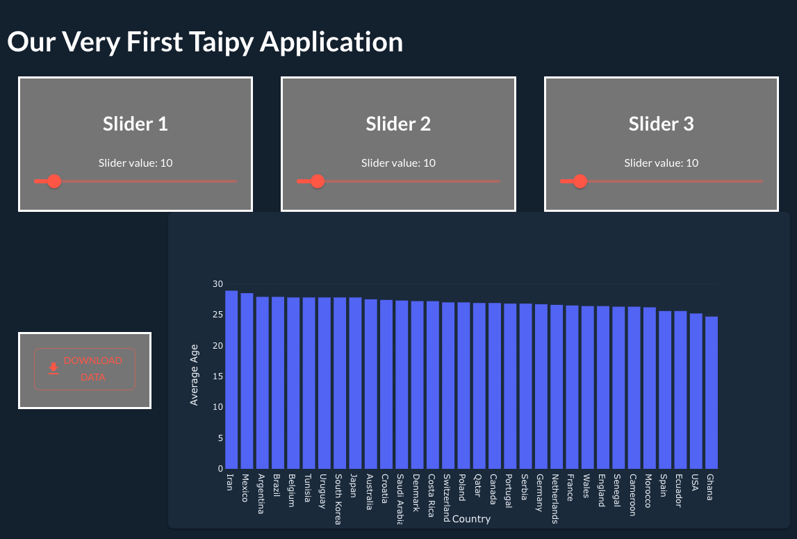

# Getting Started with Taipy


## Overview

[Taipy](https://hackp.ac/Taipy) is an open-source **Python** library used for creating full-stack web applications in no time using only Python code! It’s both easy to install and use, employing simple syntax that allows you to leverage pre-built components and features, saving you significant development time. 

In the next 10 - 15 minutes, you’ll learn how to leverage Taipy GUI to build a simple web application using some of Taipy’s built-in elements like charts and sliders, along with some styling and layout features that should get you well on your way to creating applications of your own! 

Before we get started, please note that the Taipy package requires[ Python 3.8 or newer](https://www.Python.org/downloads/). It’s also recommended that you have [pip](https://pip.pypa.io/en/stable/installation/) installed for the sake of downloading packages. 

## Setting up your Environment

First things first, let’s get our environment set up. 

Open up a terminal and follow along with the command prompts. 

```
mkdir taipy_project && cd taipy_project
touch main.py main.css

pip install taipy

code . #(optional)launches visual studio code from the command line (if you don't have visual studio code, you can use the command prompt that suits you).
```

Awesome. You should now have a main.py and main.css file in your project folder.

We’re ready to start building! 

## ‘Hello World’ 

Let’s take Taipy out for our first spin. 

We’re going to check our browser connection with our Taipy project using a simple ‘hello world.’ 

At the top of your main.py file, go ahead and input the following code. 

```Python
from Taipy import Gui

Gui(page="Hello *World*").run(use_reloader=True, port=5001)
```

As you can see, we’re importing Gui from the Taipy library to start. We then create a new Gui object that defines the **_page_** and **_run_** parameters. These two parameters will be important as we proceed, since they essentially dictate the way your web application will behave and the content it will display. 

Here we are assigning a simple string value to the page key. Notice the asterisks around “World.” This will behave similarly to Markdown, _italicizing_ whatever string we have surrounded by the asterisks. You will find that Taipy has cleverly built in the use of both Markdown and HTML syntax to make using their library more intuitive and simple. 

For the run parameter, you’ll see that we are manually assigning a port and using the reloader functionality to update our local web application whenever we refresh the browser. 

Go ahead and jump into your terminal window and run your Python script. 

```
Python main.py 

OR

Python3 main.py 

#This will depend on your initial Python configuration. If you currently have Python aliased to Python3, the Python command will automatically launch the main.py file using the latest version of Python you have installed. 
```

A window should have launched at 127.0.0.1:5001, similar to the picture.  

Go ahead and make some small changes to the page output, like removing the asterisks or changing the words, and refresh your browser page. You should see those changes reflected. 


Pretty basic stuff so far, but we’re now 100% sure that our environment setup is fully functional. 

**Quick tip:** If you’ve shut down your Python script and have some issues with your target port being in use when running your script again, you can download the _killport_ library to make clearing out your target port simpler. 

```
pip install killport 

killport 5001
```

## Using Visual Controls and Elements

Now that we’ve got our first Taipy project up and running, let’s make it a little more complex. 

Taipy has conveniently built out some great features that we can easily access with using Taipy Gui.  To start, let’s create a page title. 

Remember, we can use [HTML](https://docs.taipy.io/en/latest/manuals/gui/pages/#using-html) or [Markdown](https://docs.taipy.io/en/latest/manuals/gui/pages/#using-Markdown) syntax to define our page elements, which should simplify building our application.  

Below, you’ll see that we’re now instantiating a page variable. Your page variable value will always be encapsulated by **three sets of quotation marks**, and everything within those quotation marks will be displayed in your application. Here, I’m using some Markdown to define the page’s H1 title. 

```Python
from taipy.gui import Gui

page = """
#Our Very First Taipy Application
"""

Gui(page).run(use_reloader=True, port=5001)
```

Next, let’s add a dynamic value. Here, we’ll use a slider that will also correspond with a dynamic value within our code. First, we’ll define a value variable and set it to 10. 

Next, we’ll write out a simple label for the slider, that will also display the dynamic value as the slider is moved back and forth. Lastly, we’ll use the slider visual control and assign it the same dynamic value. (Notice the use of the self-closing br tag. This will break our slider out to the next line). 

```Python
from taipy.gui import Gui

value = 10

page = """
#Our Very First Taipy Application

Slider value: <|{value}|> <br/>
<|{value}|slider|>

"""

Gui(page).run(use_reloader=True, port=5001)
```

Our values should dynamically correspond to the slider and the result should look like the image below: 


Pretty sweet. Next, let’s add a bar chart. Charts are incredibly helpful with visualizing data but can be a hassle to build out. With Taipy, the job becomes incredibly simple, even for a Python novice like myself. 

For the sake of this demo, I found a small dataset that displays the average ages for each of the Fifa World Cup 2022 teams to seed my chart. If you want to follow along and use the same data set, you can find it [here](https://www.statista.com/statistics/1298094/average-player-age-national-teams-qatar-world-cup/). 


First things first, I’m going to move my average_age.csv into my projects folder. I’m keeping it at the top level for the sake of simplicity, but you can move yours wherever you please. Just be sure to note the path correctly in the upcoming steps. 

We’ll be using Pandas to read the CSV and the Taipy chart visual control to visualize the data. Go ahead and add the new code to your project. 

```Python
from taipy.gui import Gui
import pandas as pd

value = 10

page = """
#Our Very First Taipy Application

Slider value: <|{value}|> <br/>
<|{value}|slider|>

<|{data}|chart|type=bar|x=Country|y=Average Age|>
"""

def get_data(path: str):
    dataset= pd.read_csv(path)
    return dataset

data = get_data("average_age.csv")

Gui(page).run(use_reloader=True, port=5001)
```

After importing the pandas library, we’re defining a function that reads our CSV and returns the data. We then instantiate a variable that passes the CSV’s file path to our function.

Next, we create the chart visual control in our page, passing in our dynamic data value, and our x and y labels. Let’s run our code and see the results! 


That looks amazing, if I do say so myself, and the result was achieved with 5 lines of code.

There are so many more data visualizations you can implement in your personal projects. You can check out the full list [here](https://docs.taipy.io/en/latest/manuals/gui/viselements/chart/). There are additional instructions on how to further customize those charts, for instance, changing the color scheme or changing the chart orientation. 

If you want to play around with more Taipy features, here’s a full list of visual [controls](https://docs.taipy.io/en/latest/manuals/gui/viselements/controls/) you can use to customize your own application! 


## Styling your Components and Building a Layout

As you continue to build your application, you may find that you want to further customize the look and feel of your components and layout. Maybe you’ve decided to add 2 more sliders but don’t want to stick with the default formatting. 


I’m not going to lie, I think that looks pretty good. Let’s say, however, that you wanted all of your sliders side by side and each of them to have a different background. 

Well, the first thing we’re going to do is jump into our main.css file and build out a new class. 

```css
.container-styling{
    background-color: grey;
    color: white; 
    border: 3px solid white; 
    text-align: center; 
    justify-content: center; 
    align-items: center;
    margin: auto; 
    padding: 20px; 
}
```

We’re going to use this class to place some of our components into containers. Think of containers like divs that we place other elements into. Having some predetermined styling for each of these containers will help with development later on. 

Go ahead and implement the code below: 

```Python
from taipy.gui import Gui
import pandas as pd

value = 10

page = """
#Our Very First Taipy Application

<|layout|columns=1 1 1|

<|first column
<|container container-styling|
###Slider 1 <br/>
Slider value: <|{value}|> <br/>
<|{value}|slider|>
|>
|>

<|second column
<|container container-styling|
###Slider 2 <br/>
Slider value: <|{value}|> <br/>
<|{value}|slider|>
|>
|>

<|third column
<|container container-styling|
###Slider 3 <br/>
Slider value: <|{value}|> <br/>
<|{value}|slider|>
|>
|>
|>

<|{data}|chart|type=bar|x=Country|y=Average Age|orientation=v|>
"""

def get_data(path: str):
    dataset= pd.read_csv(path)
    return dataset

data = get_data("average_age.csv")

Gui(page, css_file = 'main.css').run(use_reloader=True, port=5001)
```


The first thing you’ll notice is that we’ve added the layout element. Everything we place into the layout element will now be broken out into 3 equally distributed columns. Changing the values of the column key will edit the distribution of each column in your layout. 

Next, I’ve placed all of my sliders into container elements, and I’ve also associated each of those container elements with the container-styling CSS class that we wrote earlier. I then labeled each container with an h3 (heading3) that will differentiate each container from the other. Finally, I imported my main.css file into my Python file at the bottom of the page as a Gui property, allowing me to successfully reference and utilize the container-styling class. 

The results should be as pictured.


You can go back and add additional variables to your own code so that each of the sliders can have different dynamic values. For now, you can see that using Taipy’s built in layout element along with containers can come in very handy when it comes to optimizing your application UI. 

You can check out more [styling](https://docs.taipy.io/en/latest/manuals/gui/styling/) and [layout](https://docs.taipy.io/en/latest/manuals/gui/viselements/layout/) tips in the Taipy documentation. 

Next, I’ll show you how to break your page out into sections. 


While having individual columns is very useful you may want to use multiple grid formats in your application, so adding sections to your page layout can be very useful.

First, let’s change the way we’re declaring our page parameter at the bottom of our main.py file. 

```Python
Gui(page=section1+section2, css_file = 'main.css').run(use_reloader=True, port=5001)
```

As you can see, we’re adding a section1 and a section2 to our application. 

Next, let’s change the original page variable we declared to section1 and add a new variable named section2 right beneath it. 

```Python
section1 = """
#Our Very First Taipy Application

<|layout|columns=1 1 1|

<|first column
<|container container-styling|
###Slider 1 <br/>
Slider value: <|{value}|> <br/>
<|{value}|slider|>
|>
|>

<|second column
<|container container-styling|
###Slider 2 <br/>
Slider value: <|{value}|> <br/>
<|{value}|slider|>
|>
|>

<|third column
<|container container-styling|
###Slider 3 <br/>
Slider value: <|{value}|> <br/>
<|{value}|slider|>
|>
|>
|>
"""
section2 = """
<|{data}|chart|type=bar|x=Country|y=Average Age|orientation=v|>
"""
```

I went ahead and moved our chart to the new section as well. Each of these new section variables will still display the same way our previous page variable did, but now, we have the opportunity to place another visual control right next to our chart. We can do so by breaking out section2 into columns, similar to section1.

Just for fun, let’s go ahead and add a download button to section2 so that our chart doesn’t get lonely. We’ll enable the button so that it allows someone to download our dataset directly from the application. 

```Python
section2 = """
<|layout|columns=1 4|

<|container container-styling|
<|{content}|file_download|label=Download|>
|>

<|{data}|chart|type=bar|x=Country|y=Average Age|orientation=v|>

|>
"""
content = "average_age.csv"
```
In this step, I placed the file_download button into it’s own container and created a new variable that points to our csv file path. I’ve also broken the section out into two separate columns with the file_download button taking up 20% and the bar chart taking up 80%. 

The results should look like this: 



Amazing. We really accomplished so much in just a matter of minutes!

## Recap

Now that we’ve learned how to set up our Taipy dev environment, built out some awesome visual elements and controls, and developed an understanding for styling and customizing our pages, the only logical next step is to take our Taipy skills to the next level with a completely original project. 

You can take what you already know and expand upon your knowledge by digging into the resources linked below. In addition, if you want a solid resource for building out your own data dashboard, check out this video on the [Taipy Youtube channel](https://www.youtube.com/watch?v=0KlZ3IDFJz4&t=1s&ab_channel=Taipy) (which this tutorial was based on). 

One thing to note, Taipy is a relatively new resource so if you have issues or encounter any roadblocks while developing, I would highly recommend you joining the [Taipy discord](https://hackp.ac/taipy-discord) and dropping your questions there. Additionally, leaving an issue on their [GitHub](https://hackp.ac/taipy-github) repository or asking a Taipy related question on Stack Overflow would be a huge help to future builders who may encounter similar problems. 

If you find it useful, be sure to add a star to the Taipy GitHub repository! 

* [https://hackp.ac/taipy](https://hackp.ac/taipy) - Getting Started Documentation
* [https://hackp.ac/taipy-github](https://hackp.ac/taipy-github) - GitHub repository 
* [https://hackp.ac/taipy-discord](https://hackp.ac/taipy-discord) - Discord Invite
* [https://hackp.ac/taipy-docs](https://hackp.ac/taipy-docs) - Latest Documentation

Happy Hacking! 
